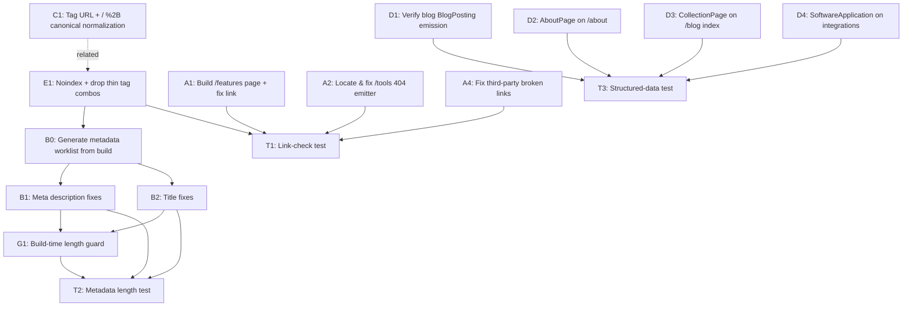

# Prepared Task: getbeton.ai SEO Crawl Fixes

> **Status:** ✅ IMPLEMENTED 2026-06-04 on branch `seo/crawl-fixes-2026-06` (stacked on `perf/build-lastmod-manifest`).
> `npm run build` passes with two new guards wired in: `seo-meta-check.mjs` (0 violations / 0 dup titles / 0 dup descriptions across 145 indexable pages) and `seo-link-check.mjs` (0 broken internal links across 307 pages). Run ad-hoc with `npm run seo:check` / `npm run seo:report`.
> Verified false-positives (no code change): blog `BlogPosting` (already emitted; 35 real articles, the "221/209" was inflated by tag pages) and hreflang (single-language site). The `/tools` 404 was two breadcrumbs hardcoding `/tools/` instead of `/oss-tools/`.
>
> **Original prep status:** Ready for implementation
> **Prepared:** 2026-06-04
> **Source:** `/prepare-task` run against the websmasher crawl of `www.getbeton.ai`
> (crawl `2026-06-04-getbeton.ai`, 295 successful HTML pages, 578 sitemap entries)
> **Repo:** `beton-main/beton-marketing-site` (Astro 5, Tailwind v4, deploys to Vercel under `getbeton` team)
> **Delivery:** Plane MCP was not connected when this was prepared, so the epic + subtasks
> live here as a markdown spec. Paste into Plane (Beton project) as an epic + child tasks when ready.

---

## Overview

A full-site SEO crawl of `www.getbeton.ai` surfaced ~232 pages with at least one
metadata/social/canonical/H1 flag, 222 pages flagged as missing an expected JSON-LD type,
3 confirmed same-site broken links, a `+`/`%2B` canonical-vs-sitemap mismatch on generated
tag pages, and 30 orphaned thin tag-combination pages.

This task fixes the **confirmed, code-attributable** issues and applies build-time guards so
the same classes of issue don't regress. Two reported issues contradict the current code and
are scoped as **verify-first** (inspect the live page before changing anything) to avoid
chasing crawler artifacts.

H1 status is clean on all 295 pages — no H1 work needed.

---

## Notes on the crawl numbers (verified 2026-06-04)

- **Per-URL CSVs absent from the handoff, but not needed.** The zip held only three summary
  markdowns; the detailed CSVs live on the auditor's machine. We do **not** depend on them — the
  metadata worklist is regenerated locally by building the site and scanning `dist/` HTML
  (titles/descriptions length + duplicate detection). See B1/B2.
- **"221 blog articles" is wrong — there are 35.** `src/data/blog/` has 35 posts. The crawler's
  221 "blog_article" bucket is inflated by ~186 auto-generated `/blog/tags/` and tag-**combination**
  URLs that pattern-match as blog content. This is the same thin-page problem as workstream E.
- **"BlogPosting missing on 209/221" is largely a false alarm.** Those ~186 extra URLs are tag
  pages, which correctly emit `ItemList`, not `BlogPosting`. Real articles missing Article schema ≈ 0.
  Killing thin tag combos (E1) collapses the property to ~35 articles + a few single-tag pages and
  makes most of these stats evaporate. D1 stays as a quick live-page confirmation.

---

## Acceptance Criteria

- [ ] Re-crawl (or local link-check) reports **0** same-site broken links (`/features`, `/tools`, `/404` JSON-LD refs resolved or correctly excluded).
- [ ] A real, indexable `/features/` page exists and renders the Features content collection; `/alternatives` no longer links to a 404.
- [ ] The `/tools` 404 emitter is located and fixed; no page emits a link or JSON-LD reference to `/tools`.
- [ ] All indexable page titles are 30–60 chars; all meta descriptions are 120–160 chars; **0** duplicate titles and **0** duplicate descriptions across indexable pages.
- [ ] Tag-page canonicals and the sitemap agree on a single URL form for `+` combination tags (no `+` vs `%2B` divergence).
- [ ] `/about` emits `AboutPage`; `/blog` index emits `CollectionPage`; the 11 integration pages emit `SoftwareApplication` (alongside existing `HowTo`).
- [ ] Blog-article `BlogPosting`/`TechArticle` emission is verified correct on a live page; fixed only if a real gap exists.
- [ ] Thin tag-combination pages are `noindex` and excluded from the sitemap; single-tag pages remain indexable.
- [ ] Confirmed third-party broken links fixed: botimize (removed), `getbeton.com`→`.ai`, `github.com/get-beton`→`getbeton`, selltoscientists `www`→apex.
- [ ] (hreflang removed from scope — single-language site)
- [ ] A build-time guard (lint/script) fails the build on out-of-range title/description length so the metadata fixes don't regress.
- [ ] `npm run build` and `npm run check` pass before commit (marketing site validates via build — see root CLAUDE.md).

---

## Technical Constraints

- **Astro 5 + Tailwind v4.** All SEO output flows through `src/components/seo/Head.astro`, `src/components/seo/SchemaOrg.astro`, `src/components/seo/OpenGraph.astro`, and the layouts (`BaseLayout` → `PageLayout`/`BlogPostLayout`). Prefer fixing at the template/component level over per-page edits where the issue is systemic.
- **Canonical helper:** `src/utils/seo.ts` `buildCanonicalUrl()` force-adds a trailing slash; it does **not** URL-encode. Astro's `@astrojs/sitemap` XML-encodes `+` → `%2B`. The mismatch must be resolved on one side, consistently.
- **Content schema enforces lengths** for blog frontmatter only (`src/content.config.ts`: `metaTitle` max 60, `metaDescription` max 160). Generated pages (oss-tools scenarios, integrations, tag pages, use-cases) and pages falling back to `SITE.description` (`src/utils/site.ts`) are **not** covered — that's where most of the 160 short descriptions live.
- **Sitemap filter** already exists at `astro.config.mjs` (`sitemap({ filter: ... })`, ~line 101) excluding `/404`, `/oss-tools/seqd/`, and `comingSoon` integrations. Extend this for thin tag-combos rather than adding a new mechanism.
- **No secrets** in repo. **Build before commit** (blocking). Feature branch → PR.

---

## Out of Scope

- Lighthouse performance/accessibility fixes (the crawler did not run Lighthouse; those CSVs are placeholders).
- Third-party URL failures (`botimize.me`, `getbeton.com`, `github.com/get-beton`, LinkedIn, `selltoscientists.com` timeouts, `mailto:` false-positives) — review queue, not same-site fixes. Handle separately if desired.
- New analytics events / Intercom onboarding / newsletter changelog / Stripe — not applicable to this SEO task (the standard `/prepare-task` categories don't apply to a static marketing-site SEO pass).
- Multi-language hreflang (site is English-only; `en` + `x-default` is correct).

---

## Decisions Made (from clarification)

1. **`/features` broken link → build the page.** Create a real `/features/` route rendering the existing `src/data/features` collection (6 entries today). Keep the `/alternatives` anchor pointing at it.
2. **Thin tag-combination pages → noindex + drop from sitemap.** Single-tag pages stay indexable; multi-tag combination pages get `noindex` and are excluded from the sitemap (matches the thin-content-gate approach used on the data sites).
3. **Integration pages → add `SoftwareApplication`.** Emit `SoftwareApplication` on the 11 integration pages alongside the existing `HowTo`.
4. **Two findings are verify-first** (code already appears to emit them): blog `BlogPosting` (209/221) and the `/tools` 404 source. Inspect before editing.

---

## Workstream / Dependency Map

---

## Subtasks

Each task is plain-English spec only. File:line references are current as of 2026-06-04.

---

### A1 — Build `/features/` page and fix the broken `/alternatives` link

**Why:** `src/pages/alternatives/index.astro:102` links to `/features/` which 404s. A `features`
content collection exists (`src/content.config.ts:47`, data in `src/data/features/` — 6 markdown
files: crm-sync, multi-destination-routing, posthog-integration, real-time-alerts,
signal-detection, webhook-n8n) but no page renders it.

**Spec:**
- Create `src/pages/features/index.astro` using `PageLayout`, rendering the `features` collection
  (group/featured-first as appropriate). Reuse existing card/section components for visual
  consistency with `/use-cases` and `/alternatives`.
- Provide a unique, length-valid title and meta description (see B-series rules).
- Add `BreadcrumbList` via the existing `breadcrumbs` prop. Decide whether to emit
  `ItemList`/`CollectionPage` for the features list (consistent with D3 blog-index treatment).
- Ensure the new route is picked up by the sitemap (no filter exclusion needed).
- Confirm `/alternatives/index.astro:102` anchor now resolves (trailing slash matches canonical
  policy — keep `/features/`).

**Acceptance:** `/features/` returns 200 and is indexable; `/alternatives` link resolves; page
passes length + schema guards.

**Depends on:** none. **Blocks:** T1.

---

### A2 — Locate and fix the `/tools` 404 emitter (verify-first)

**Why:** Crawl reports `https://www.getbeton.ai/tools/` returns 404 and is referenced from **17**
pages, first source `/oss-tools/dryfit/scenarios/posthog-combined-coverage/`. A plain source grep
for `/tools` found **zero** matches, so the reference is emitted dynamically — most likely a
breadcrumb, a JSON-LD `isPartOf`/`url`, or an `itemListElement` on the dryfit-scenarios template.

**Spec:**
- Inspect a live offending page (e.g. fetch `/oss-tools/dryfit/scenarios/posthog-combined-coverage/`)
  and grep the rendered HTML + JSON-LD for `/tools`. Trace back to the template
  (`src/pages/oss-tools/...` scenario route and/or `SchemaOrg.astro` breadcrumb/dataset blocks).
- Fix the source so it points to the correct existing route (`/oss-tools/` or the specific tool)
  rather than `/tools/`, or remove the stray reference.
- Re-check all 17 source pages after the fix.

**Acceptance:** No rendered page references `/tools`; re-crawl shows 0 occurrences.

**Depends on:** none. **Blocks:** T1.

---

### A3 — Resolve `/404` JSON-LD self-references (low priority)

**Why:** The crawl flags `/404` (status 404) referenced via JSON-LD `#primaryimage` node anchors
(e.g. from `/features/`). The 404 page is correctly `noIndex` (`src/pages/404.astro:8`). The
`ImageObject` `@id` of `https://www.getbeton.ai/404/#primaryimage` (`SchemaOrg.astro`, ImageObject
block ~line 114) is a graph-internal node reference, not a real broken hyperlink.

**Spec:** Confirm this is a crawler artifact (node `@id` ≠ navigable URL). If desired, suppress
`primaryImageOfPage`/`ImageObject` emission on `noIndex` pages so the 404 graph carries no image
node. Otherwise close as won't-fix with a one-line note.

**Acceptance:** Documented decision; if changed, 404 emits no `#primaryimage` node.

**Depends on:** none. **Blocks:** none.

---

### B0 — Generate the metadata worklist locally (no external CSV needed)

**Why:** The per-URL CSVs weren't shipped and aren't needed. We regenerate the worklist ourselves.

**Spec:** `npm run build`, then run a small script over `dist/` that emits, per indexable URL:
current title length, description length, and duplicate-group membership for both. Group the worklist
by template (blog, oss-tools scenarios, integrations, use-cases, single-tag pages, static pages).
Exclude pages slated for `noindex` in E1 so we don't write copy for pages we're about to drop.

**Acceptance:** A concrete per-URL worklist exists in the repo (e.g. `docs/seo/metadata-worklist.csv`),
generated from the live build.

**Depends on:** E1 (so noindexed thin pages are excluded). **Blocks:** B1, B2.

---

### B1 — Meta description fixes (after E1 prunes thin pages; expect far fewer than 160)

**Why:** 160 descriptions too short, 19 too long, 14 duplicated. Pages with no explicit description
fall back to `SITE.description` (`src/utils/site.ts:5`), which produces duplicates.

**Spec (template-level first, then per-page):**
- **Generated templates** (most of the volume): give oss-tools scenario, integration, tag, and
  use-case templates a meaningful, unique, 120–160-char description built from the entity's own
  fields (name, summary, key data points) instead of falling back to `SITE.description`.
- **Blog/static pages:** fill/rewrite `metaDescription` frontmatter to 120–160 chars, unique per page.
- Eliminate the bare `SITE.description` fallback for indexable pages (keep only as a last-resort for
  truly generic routes); ensure no two indexable pages share a description.
- Target band: **120–160 chars** (schema currently only caps at 160; add a floor — see G1).

**Acceptance:** All indexable descriptions 120–160 chars, 0 duplicates.

**Depends on:** B0. **Blocks:** T2, G1.

---

### B2 — Title fixes (37 too long, 9 too short, 2 duplicate)

**Why:** 37 titles >60 chars, 9 <30 chars, 2 duplicate titles. `buildTitle()`
(`src/utils/seo.ts:12`) appends ` | Beton`, which pushes long base titles over 60.

**Spec:**
- Shorten the 37 long base titles so the final ` | Beton`-suffixed title is ≤60 chars (account for
  the 8-char suffix in the budget).
- Expand the 9 thin titles to ≥30 meaningful chars.
- Disambiguate the 2 duplicate titles (likely paginated or near-identical generated pages).
- Where titles are template-generated, fix the template formula, not individual pages.

**Acceptance:** All indexable titles 30–60 chars (post-suffix), 0 duplicates.

**Depends on:** B0. **Blocks:** T2, G1.

---

### C1 — Normalize tag-page URLs: `+` vs `%2B`

**Why:** Combination tag pages (e.g. `agents+beton`) emit a canonical with a literal `+`
(`src/pages/blog/tags/[...tag].astro` builds `canonical = /blog/tags/${slugSet.join('+')}/`), but
`@astrojs/sitemap` XML-encodes it to `%2B`. The crawler then sees `%2B` URLs whose canonical says
`+` → 150 "canonical points elsewhere" flags and ambiguous indexing.

**Spec:** Pick one canonical form and make page-canonical + sitemap + internal links agree:
- **Recommended:** stop generating multi-tag combination routes entirely (see E1) — that removes the
  problem at the root for combos. For any remaining `+` URLs, ensure the sitemap entry and the page
  `<link rel="canonical">` use byte-identical encoding (normalize the slug, e.g. hyphen-join
  `agents-beton` instead of `+`, or consistently encode/decode on both sides).
- Verify single-tag pages are unaffected.

**Acceptance:** For every tag URL in the sitemap, the target page's canonical string matches exactly
(no `+`/`%2B` divergence).

**Depends on:** none. **Related to:** E1 (do together). **Blocks:** T1.

---

### D1 — Verify blog `BlogPosting` emission (verify-first)

**Why:** Report says `BlogPosting` missing on 209/221 blog articles, but `BlogPostLayout.astro`
(~lines 356–394) clearly emits `BlogPosting` (or `TechArticle` for `pricing teardown` tagged posts).
Likely a crawler artifact: it expected top-level `BlogPosting` but the type sits inside the `@graph`
array, or `TechArticle` (a valid, more-specific type) counts as "missing BlogPosting."

**Spec:**
- Fetch 2–3 live blog articles (one teardown, two regular) and inspect the emitted JSON-LD.
- Confirm `BlogPosting`/`TechArticle` is present and valid (Google Rich Results test).
- **Only if a real gap exists** (e.g. a subset of posts via a different layout emit nothing), fix it.
- Document the finding either way (likely: "false positive — BlogPosting present in @graph; TechArticle used for teardowns by design").

**Acceptance:** Documented verification; representative blog pages pass Rich Results with an Article-family type.

**Depends on:** none. **Blocks:** T3.

---

### D2 — Add `AboutPage` schema to `/about`

**Why:** `/about` emits only the global `WebPage` + `Organization` + `WebSite`; report expects `AboutPage`.

**Spec:** In `SchemaOrg.astro`, support an `AboutPage` page type (or pass a `schemaType`/page-type prop
from the about route) so `/about` emits `AboutPage` referencing the `Organization` node. Reuse the
existing `@graph` + `WebPage` machinery.

**Acceptance:** `/about` JSON-LD includes `AboutPage`; passes Rich Results.

**Depends on:** none. **Blocks:** T3.

---

### D3 — Add `CollectionPage` schema to `/blog` index

**Why:** `/blog` index emits `ItemList` only (`src/pages/blog/index.astro:29–36`); report expects `CollectionPage`.

**Spec:** Emit `CollectionPage` wrapping/alongside the existing `ItemList` (CollectionPage with
`mainEntity`/`hasPart` → the ItemList). Apply the same pattern to tag-listing pages and the new
`/features` page if consistent.

**Acceptance:** `/blog` JSON-LD includes `CollectionPage`; passes Rich Results.

**Depends on:** none. **Blocks:** T3.

---

### D4 — Add `SoftwareApplication` to the 11 integration pages

**Why:** Integration pages (`src/pages/integrations/[id].astro`) emit `HowTo` + `WebPage` but not
`SoftwareApplication`; report expects it. (Decision: add it.)

**Spec:** Extend `SchemaOrg.astro` (the existing `SoftwareApplication` block ~lines 186–230 is product-scoped)
to emit a `SoftwareApplication` representing the integration — name = "Beton + {Integration}" (or the
integration's own app), `applicationCategory`, `operatingSystem`, an `Offer`, and `isRelatedTo`/`isPartOf`
the Beton Organization. Drive it from the integration's `integrations.json` entry. Keep the existing
`HowTo`.

**Acceptance:** All 11 live integration pages emit valid `SoftwareApplication`; pass Rich Results.

**Depends on:** none. **Blocks:** T3.

---

### E1 — Noindex thin tag-combination pages and drop them from the sitemap

**Why:** 30 orphaned tag-combination pages (in sitemap, no internal inbound links, thin). The
powerset slug generator (`src/pages/blog/tags/[...tag].astro:11–37`) creates every multi-tag
combination present on ≥1 post.

**Spec:**
- In the tag template, set `noIndex` when the slug is a **multi-tag combination** (single-tag pages
  stay indexable).
- Extend the sitemap `filter` in `astro.config.mjs` (~line 101, alongside `/404` and `/oss-tools/seqd/`)
  to exclude multi-tag combination paths.
- This also retires the `+`/`%2B` combos at the root — coordinate with C1 (single-tag pages keep clean canonicals).

**Acceptance:** Multi-tag combo pages return `noindex` and are absent from the sitemap; single-tag
pages remain indexable and in the sitemap; orphan count drops to ~0.

**Depends on:** none. **Related to:** C1. **Blocks:** T1.

---

### A4 — Fix confirmed third-party broken links

**Why:** The crawl's third-party review queue, triaged against the code (2026-06-04):

| Reference | Reality | Location | Action |
|---|---|---|---|
| `https://botimize.me` | Domain expired (timeout) | `src/data/social-proof/companies.json:31` (customer logo) | Remove the botimize entry (logo + url) |
| `https://getbeton.com` | Never owned by Beton | `src/data/blog/coolify-pricing-teardown.md:150` | → `https://getbeton.ai` |
| `https://github.com/get-beton` | 404 (org is `getbeton`) | `src/data/blog/first-party-vs-third-party-signals.md:217` | → `https://github.com/getbeton/inspector-ml-backend` (verified 200) |
| `https://www.selltoscientists.com` | Apex 200, but `www.` subdomain has no DNS record | `src/utils/navigation.ts:46` | Point link to apex `https://selltoscientists.com` **and/or** add a `www`→apex redirect on the selltoscientists Vercel project |
| `mailto:` links | Not broken — crawler can't HTTP-fetch the `mailto:` scheme | various | No action; exclude scheme from link-checking |

**Spec:** Apply the four edits above. For selltoscientists, the in-repo fix is the apex link; flag to
Vlad whether to also add the `www` DNS/redirect (fixes it property-wide, out of this repo).

**Acceptance:** All four references resolve (200); re-crawl third-party queue clears except known
`mailto:` false-positives.

**Depends on:** none. **Blocks:** T1.

---

### F1 — Hreflang: REMOVED FROM SCOPE (decision 2026-06-04)

getbeton.ai is single-language (English), single-region. hreflang only matters for multi-language /
multi-region sites. The existing self-referencing `en` + `x-default` tags (`Head.astro:74–75`) are
harmless boilerplate; the crawl's flag targets the Sitelinks-searchbox template URL
`/search/?q={search_term_string}`, not a real page. **No action.** Optionally remove the hreflang tags
to simplify the `<head>`, but it's cosmetic.

---

### G1 — Build-time length guard (regression prevention)

**Why:** Nothing currently fails the build on bad title/description length for non-blog pages, so
the B-series fixes would silently regress.

**Spec:** Add a post-build (or integration) check that scans rendered pages and **fails the build** if
any indexable page has title outside 30–60 chars, description outside 120–160 chars, or a duplicate
title/description. Wire into `npm run check`/CI. Extend the content schema with a `metaDescription`
**min** length for collections where feasible.

**Acceptance:** Introducing an out-of-range title/description fails `npm run build`/`check`.

**Depends on:** B1, B2. **Blocks:** T2.

---

## Test Tasks

> Per `/prepare-task` convention, implementation tasks depend on their test tasks — write the check
> first, then make it pass.

### T1 — Test: same-site link health
**Cases (Given/When/Then):**
- Given a fresh production build, When the link checker / re-crawl runs, Then there are **0** same-site
  404s (specifically `/features`, `/tools`, and any new `/features/` internal links resolve).
- Given the rendered HTML of all 17 former `/tools` source pages, When grepped, Then **0** references
  to `/tools` remain.
- Given the sitemap, When each entry is fetched, Then none return 404 and none are multi-tag combo pages.

**Relates to:** A1, A2, C1, E1.

### T2 — Test: metadata length & uniqueness
**Cases:**
- Given all indexable pages, When titles are measured, Then each is 30–60 chars (post ` | Beton` suffix).
- Given all indexable pages, When descriptions are measured, Then each is 120–160 chars.
- Given all indexable pages, Then there are 0 duplicate titles and 0 duplicate descriptions.
- Given an intentionally bad title/description, When `npm run build` runs, Then it fails (G1 guard works).

**Relates to:** B1, B2, G1.

### T3 — Test: structured data validity
**Cases:**
- Given `/about`, `/blog`, a blog article, and an integration page, When run through Google Rich Results /
  a schema validator, Then each emits its expected type with no errors:
  `/about` → `AboutPage`; `/blog` → `CollectionPage`; blog article → `BlogPosting`/`TechArticle`;
  integration → `SoftwareApplication` + `HowTo`.
- Given any page's `@graph`, Then all `@id` node references resolve within the graph (no dangling refs).

**Relates to:** D1, D2, D3, D4.

---

## Reference Links (attach in Plane)

- Schema.org types: `AboutPage` https://schema.org/AboutPage · `CollectionPage` https://schema.org/CollectionPage · `SoftwareApplication` https://schema.org/SoftwareApplication · `BlogPosting` https://schema.org/BlogPosting
- Google structured data docs: https://developers.google.com/search/docs/appearance/structured-data
- Rich Results Test: https://search.google.com/test/rich-results
- `@astrojs/sitemap` (filter/serialize): https://docs.astro.build/en/guides/integrations-guide/sitemap/
- Astro SEO / canonical: https://docs.astro.build/en/guides/integrations-guide/sitemap/#canonicalurl
- Google title/meta guidance: https://developers.google.com/search/docs/appearance/title-link · https://developers.google.com/search/docs/appearance/snippet

---

## Key files (current state, 2026-06-04)

| Concern | File | Notes |
|---|---|---|
| Title/desc/OG/canonical | `src/components/seo/Head.astro` | `buildTitle`, default desc = `SITE.description` |
| Title/canonical helpers | `src/utils/seo.ts` | `buildTitle` (+` \| Beton`), `buildCanonicalUrl` (force trailing slash, no encoding) |
| Default description | `src/utils/site.ts` | `SITE.description` fallback (source of dup descriptions) |
| JSON-LD `@graph` | `src/components/seo/SchemaOrg.astro` | Org/WebSite/WebPage/ImageObject global; SoftwareApplication ~186, FAQ ~232, Breadcrumb ~247, Dataset ~315 |
| Blog article schema | `src/layouts/BlogPostLayout.astro` | BlogPosting/TechArticle ~356–394 |
| Blog index | `src/pages/blog/index.astro` | ItemList ~29–36 (no CollectionPage) |
| Tag pages | `src/pages/blog/tags/[...tag].astro` | powerset slugs ~11–37; canonical `+`-join ~54 |
| Integrations | `src/pages/integrations/[id].astro` | HowTo emitted; no SoftwareApplication |
| Broken link | `src/pages/alternatives/index.astro:102` | `<a href="/features/">` → 404 |
| Features collection | `src/content.config.ts:47` + `src/data/features/*.md` | 6 entries, no page renders them |
| Sitemap config | `astro.config.mjs` ~85–125 | `filter` ~101 excludes /404, seqd, comingSoon; lastmod from `src/data/lastmod.json` |
| Sitemap flatten | `scripts/post-build-sitemap.mjs` | dist sitemap → `/sitemap.xml` |
| 404 | `src/pages/404.astro:8` | `noIndex` |
| Search | `src/pages/search.astro:99` | `canonicalPath="/search/"` |
